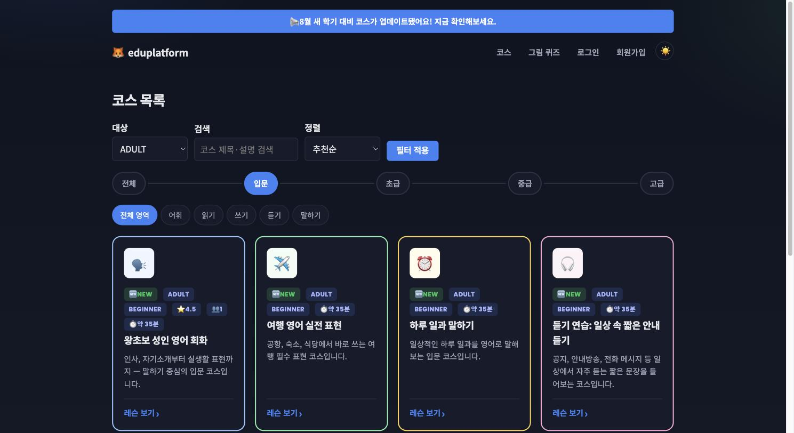
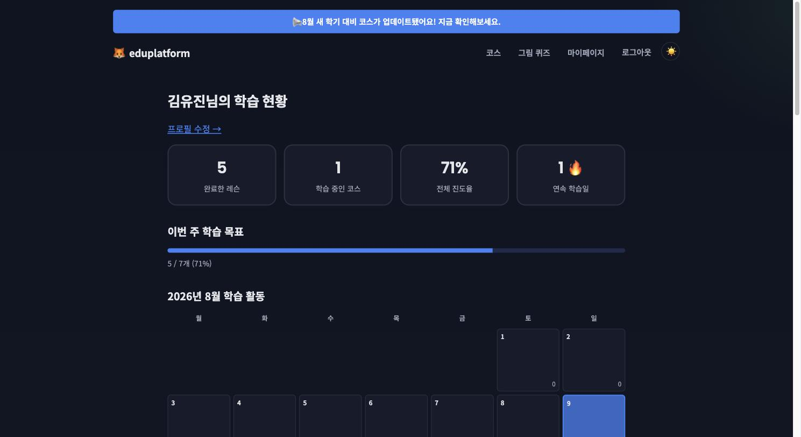
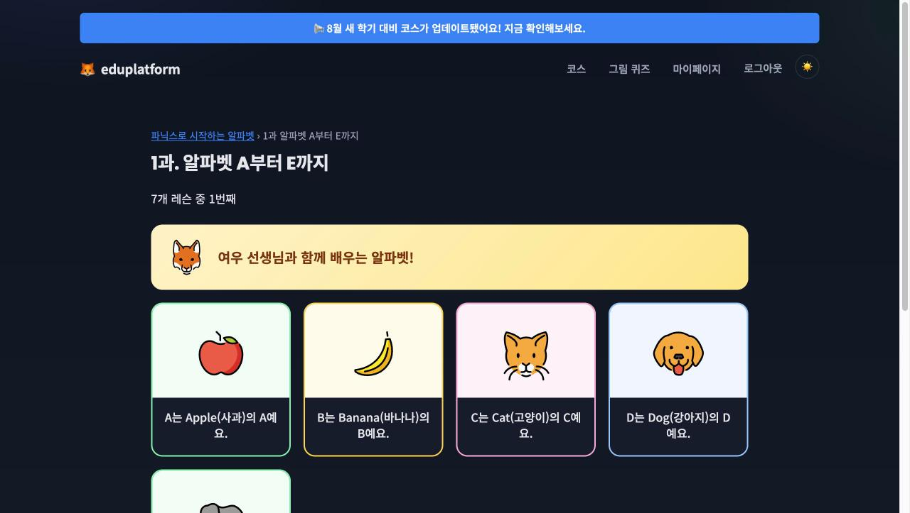
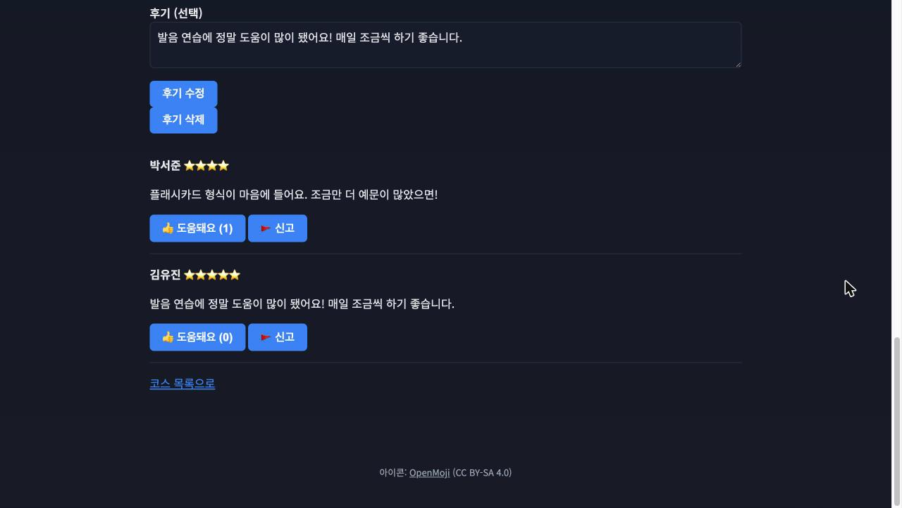
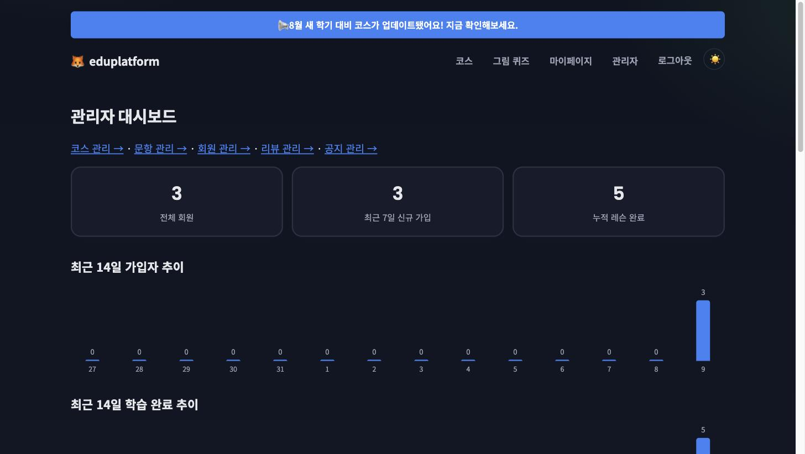

# 🦊 eduplatform

초등학생과 성인이 **입문부터 단계별 로드맵**을 따라 듣기·말하기·읽기·쓰기를 종합적으로 학습하고,
개인의 약점 영역에 맞춘 코스로 스스로를 관리해 나가는 영어 학습 웹 플랫폼입니다.

[](#)
[](#)
[](#)
[](#)
[](#)

> 📄 기획 배경은 [docs/PRODUCT.md](docs/PRODUCT.md), 기술 설계는 [docs/DESIGN.md](docs/DESIGN.md),
> 전체 산출물 목록은 [docs/DELIVERABLE.md](docs/DELIVERABLE.md), 개발 진행 이력은
> [CLAUDE.md](CLAUDE.md)에 있습니다.

---

## ✨ 한눈에 보기

| | |
|---|---|
| 🎯 **대상** | 초등학생(CHILD) · 성인(ADULT), 각각 입문~고급 4단계 |
| 📚 **콘텐츠** | 공식 코스 49개 · 레슨 343개 · 진단 문항 80개, 5대 영역(어휘·읽기·쓰기·듣기·말하기) 전부 커버 |
| 🙋 **개인화** | 자가 선택 / 학습 이력 기반 / 진단 테스트 — 3가지 방식으로 나만의 코스 생성 |
| 🔁 **리텐션** | 스트릭 · 월간 캘린더 · 주간 목표 · 간격 반복 복습 · 그림 퀴즈 · 매일 단어장 · 업적 배지 |
| 🏆 **경쟁 동기부여** | 학습 리더보드(스트릭 기준 전체 회원 순위, 비회원도 열람 가능) |
| ⭐ **커뮤니티** | 코스 평점/후기, 도움돼요 투표, 신고, 즐겨찾기, 인기순 정렬 |
| 🛡️ **관리자** | 콘텐츠 CRUD, 운영 통계 대시보드, 회원/리뷰/공지 관리 |
| ✅ **품질** | 자동화 테스트 365개, 보안 헤더(CSP/HSTS 등), 다크모드, 반응형, 웹 접근성(a11y) |

## 📸 스크린샷

<table>
<tr>
<td width="50%">

**랜딩 페이지** (다크모드 + 공지 배너)


</td>
<td width="50%">

**코스 목록** (검색·필터·정렬·배지)


</td>
</tr>
<tr>
<td width="50%">

**마이페이지 대시보드** (스탯·주간 목표·활동 캘린더)


</td>
<td width="50%">

**레슨 플래시카드** (마스코트·아이콘 카드)


</td>
</tr>
<tr>
<td width="50%">

**코스 후기** (도움돼요 투표·신고)


</td>
<td width="50%">

**관리자 대시보드** (운영 통계 추이 그래프)


</td>
</tr>
</table>

## 🚀 빠른 시작

```bash
# 빌드 + 전체 테스트(365개)
./gradlew build

# 포그라운드 실행
./gradlew bootRun

# 또는 백그라운드 실행 (로그: build/bootRun.log)
./scripts/run-dev.sh
./scripts/stop-dev.sh
```

- 앱: http://localhost:8080
- H2 콘솔: http://localhost:8080/h2-console (JDBC URL `jdbc:h2:mem:eduplatform`, user `sa`)
- 관리자 계정: `admin@eduplatform.com` / `Admin1234!` (서버 기동 시 고정 시드, H2가 인메모리라 매
  재시작마다 새로 시딩됨)

## 🧩 기능 요약

<details>
<summary><b>계정 · 보안</b></summary>

- 이메일 인증 2단계 회원가입, 로그인 시도 제한(5회 실패 시 15분 잠금)
- 레벨 배치 테스트, 프로필 관리(닉네임·레벨·주간 목표·비밀번호), 비밀번호 찾기
- 회원 탈퇴(자진) + 관리자 강제 탈퇴, 비회원은 코스별 첫 레슨만 열람 가능
- CSP · HSTS · Referrer-Policy · Permissions-Policy 응답 헤더 전 페이지 적용

</details>

<details>
<summary><b>학습 콘텐츠</b></summary>

- 대상×레벨 8개 조합 전부에 5대 영역이 채워진 공식 코스(49개)·레슨(343개)
- 제목·설명·레슨 본문 검색, 인기순/평점순/즐겨찾기순 정렬
- 이해도 확인 퀴즈(정답이어야 완료 처리), 브라우저 음성인식 말하기 연습
- 코스 완료 시 다음 코스 자동 추천 + 인쇄 가능한 디지털 수료증

</details>

<details>
<summary><b>개인화 · 동기부여</b></summary>

- 개인 코스 3방식: 자가 선택 / 학습 이력 기반(약점 커버리지 자동 계산) / 진단 테스트(80문항 채점)
- 학습 스트릭, 월간 활동 캘린더, 주간 학습 목표, 최근 활동 히스토리, 업적 배지(13종)
- 간격 반복 복습(+헤더 알림 배지), 그림 퀴즈, 매일 단어장/단어 퀴즈, 학습 리더보드 — 전부 저장
  없이 즉석 생성

</details>

<details>
<summary><b>커뮤니티 · 관리자</b></summary>

- 코스 평점/후기 + 도움돼요 투표 + 신고, 즐겨찾기
- 관리자: 코스/레슨/문항 CRUD, 회원 관리(역할·강제 탈퇴), 리뷰 관리, 공지 배너, 운영 통계·콘텐츠
  커버리지 대시보드

</details>

## 🛠️ 기술 스택

| 영역 | 선택 |
|------|------|
| 언어/런타임 | Java 21 |
| 프레임워크 | Spring Boot 4.1.0 · Spring Framework 7.x · Spring Security 7.1.0 |
| 데이터 | Spring Data JPA / Hibernate 7.4 · H2(인메모리) |
| 뷰 | Thymeleaf 서버 렌더링(+ `sec:authorize`) |
| 빌드 | Gradle 9.5.1 |
| 클라이언트 JS | 바닐라 3개 파일만(TTS/음성인식, 다크모드, 수료증 인쇄) — 프레임워크·번들러·AJAX 없음 |

패키지는 기능별(package-by-feature)로 구성됩니다 — `member` / `course` / `lesson` / `progress` /
`question` / `quiz` / `announcement` / `common`. 상세 구조는 [docs/DESIGN.md](docs/DESIGN.md) 참고.

## 🌱 개발 방식

이 프로젝트는 Claude Code와의 반복 세션으로 만들어졌습니다 — 기능 단위로 계획 → 구현 → 단위/통합
테스트 → 실서버 검증(curl/브라우저) → 문서화 → 커밋 사이클을 매번 반복했고, 그 과정 전체가
[CLAUDE.md](CLAUDE.md)에 시간순으로 기록돼 있습니다. 브랜치는 `feature/*` → `dev`(통합) →
`main`(배포) 순으로 흐릅니다.

## 📖 더 읽어보기

- [docs/PRODUCT.md](docs/PRODUCT.md) — 무엇을, 왜 만들었는가(기획서)
- [docs/DESIGN.md](docs/DESIGN.md) — 어떻게 만들었는가(아키텍처, ERD, API/화면 설계, 보안)
- [docs/DELIVERABLE.md](docs/DELIVERABLE.md) — 실제로 완성된 산출물 전체 목록
- [CLAUDE.md](CLAUDE.md) — 세션별 개발 이력(버그 수정·의사결정 배경 포함, 가장 상세함)
