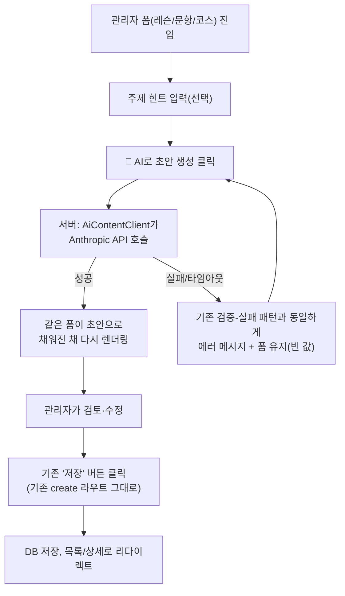

# AI 기반 콘텐츠 초안 생성 — 기획서 (제안, 미구현)

> **상태: 제안 단계.** 아직 구현되지 않았다. 사용자 승인 후 별도 세션에서 `EnterPlanMode` →
> 구현 사이클을 거쳐 착수한다. 이 문서는 "무엇을·왜·어떻게 만들 것인가"를 미리 정리해 구현 시작
> 시점에 계획 단계를 다시 밟지 않아도 되게 하는 것이 목적이다.
> 구현되면 [PRODUCT.md](PRODUCT.md)/[DESIGN.md](DESIGN.md)/[DELIVERABLE.md](DELIVERABLE.md)로
> 내용이 옮겨가고 이 문서는 이력 참고용으로 남는다.

## 1. 배경 — 이 기능이 필요한 이유

지금까지 공식 코스·레슨·문항 콘텐츠는 전부 같은 방식으로 늘려왔다: 배경 에이전트(Claude)에게
"이 대상·레벨·영역에 맞는 문장을 써줘"라고 시켜 텍스트를 받고, 사람이 그 결과를
`SampleDataInitializer.java`/`QuestionDataInitializer.java`에 손으로 붙여넣거나(관리자 화면이
생기기 전) 관리자 폼에 手동으로 옮겨 적었다. `CLAUDE.md`에 이미 이 과정의 한계가 여러 번
기록돼 있다.

- *"4개 백그라운드 에이전트로 대상×레벨 조합별 콘텐츠를 병렬 작성시켜
  `SampleDataInitializer.COURSE_SEEDS`에 반영."* — 에이전트 호출과 결과 반영이 완전히 수작업.
- *"에이전트 3개 결과를 파일에 붙여넣던 중 (...) 4개 코스 중 뒤쪽 2개를 붙여넣는 걸 빠뜨림"* —
  수작업 붙여넣기 자체가 실제 데이터 유실 버그의 원인이 된 사례.
- 관리자 콘텐츠 관리 화면을 만들 때 이미 이렇게 정리해뒀다: *"코스·레슨을 화면에서 만들고 고치는
  최소 관리자 UI를 추가해 앞으로의 콘텐츠 작업을 코드 편집 없이 할 수 있게 함."* — 이 작업으로
  "코드 편집 없이"는 해결됐지만, **콘텐츠를 처음 초안 잡는 단계(에이전트 호출 → 결과 확인 → 옮겨
  적기)는 여전히 수작업으로 남아 있다.**

이 기능은 그 남은 수작업을 관리자 화면 안으로 들여온다 — "AI 에이전트를 따로 불러 결과를
복사·붙여넣기"가 아니라, **관리자 폼 안의 버튼 하나로 그 자리에서 초안을 만들고 바로 검토·수정·
저장**하는 것이 목표다.

## 2. 목표 · 성공 기준

- 관리자가 레슨/문항/코스 생성 폼에서 "🤖 AI로 초안 생성" 버튼을 누르면, 실제 LLM API(Anthropic)를
  서버가 호출해 그 콘텐츠 타입에 맞는 초안을 만들고 **같은 폼의 입력 필드에 채워서 다시 보여준다.**
- 관리자는 그 초안을 검토하고 필요하면 고친 뒤, **기존과 동일한 "저장" 버튼**으로 등록한다 — 초안
  생성과 실제 저장은 분리된 단계이며, AI 결과가 검증 없이 그대로 DB에 들어가는 경로는 없다.
- 새 클라이언트 JS·AJAX 도입 없이, 이 프로젝트가 지금까지 지켜온 "서버 렌더링 폼 제출" 패턴
  그대로 구현한다(아래 5절 참고).
- 성공 기준: 레슨 하나 기준으로 "AI로 초안 생성 → 검토 → 저장"까지 걸리는 시간이 "배경 에이전트
  호출 → 결과 확인 → 관리자 폼에 옮겨 적기"보다 짧고, 최소 관리자가 수작업으로 옮겨 적다가 생기는
  누락·오타 위험이 없어져야 한다.

## 3. 범위

### 이번에 만드는 것 (1단계)

- **레슨 초안 생성** — 코스 상세(`/admin/courses/{courseId}`)의 "레슨 추가" 폼에 주제 힌트
  입력칸 + "AI로 초안 생성" 버튼. 코스의 `targetType`/`level`을 이미 알고 있으니 자동으로 반영,
  관리자는 `lessonType`과 (선택) 짧은 주제 힌트만 고르면 된다.
- **진단 문항 초안 생성** — 문항 생성 폼(`/admin/questions/new`)에 같은 방식의 버튼. 대상·레벨·
  영역을 고르면 4지선다 문항 초안(LISTENING이면 `audioText` 포함)을 만든다.
- **코스 초안 생성** — 코스 생성 폼(`/admin/courses/new`)에 같은 방식의 버튼. 대상·레벨·주제
  힌트를 주면 제목·설명·이모지 초안을 만든다.

세 곳 다 **같은 백엔드 패턴**(6절)을 공유하므로 실제로는 하나의 인프라(`AiContentClient` +
프롬프트 템플릿 3종)를 만들고 컨트롤러 3곳에 얇게 연결하는 작업이다.

### 이번엔 안 함 (범위 제외)

- **일괄/배치 생성**(예: "레벨 하나 전체를 한 번에 채워줘") — 1단계는 "레슨 1개/문항 1개/코스 1개"
  단위 초안만. 배치는 검토 부담이 커 사람이 하나씩 확인하는 흐름을 깨뜨린다고 판단, 후속 과제.
- **자동 저장**(사람 검토 없이 AI 결과를 바로 DB에 반영) — 원칙적으로 배제. 저장은 항상 기존
  "저장" 버튼을 통해서만.
- **이미지/오디오 생성** — 텍스트 콘텐츠만. OpenMoji 아이콘·TTS는 지금 방식(코드 매핑/브라우저
  내장 API) 그대로 유지.
- **비회원/일반 회원 대상 AI 기능**(예: 회원이 스스로 학습 콘텐츠를 생성) — 전부 관리자 전용.
- **프롬프트/모델 설정을 관리자 화면에서 바꾸는 UI** — 모델명·시스템 프롬프트는 코드/설정 파일에
  고정, 런타임 변경 UI는 과한 범위로 판단.

## 4. 사용자 흐름

핵심은 "AI 초안 생성"과 "저장"이 **서로 다른 두 번의 POST**라는 것 — 초안 생성 라우트는 절대 DB에
쓰지 않고, 항상 기존 create 라우트(`POST /admin/courses/{id}/lessons/new` 등)를 통해서만 저장된다.
이렇게 하면 AI 응답 파싱이 실패하거나 이상한 값을 만들어도 최악의 경우 "폼이 안 채워짐"이지
"잘못된 데이터가 저장됨"이 될 수 없다.

## 5. 왜 새 AJAX 없이 되는가

이 프로젝트의 관리자 CRUD 3종(코스/레슨/문항)은 전부 "`@Valid` 검증 실패 시 같은 템플릿을
`form` 모델 속성과 함께 다시 렌더링"하는 패턴을 이미 쓰고 있다(`CourseAdminController`/
`LessonAdminController`/`QuestionAdminController`, `admin/*-form.html`). **AI 초안 생성도 정확히
같은 메커니즘을 재사용한다** — "검증 실패로 폼을 다시 그린다" 대신 "AI가 채운 값으로 폼을 다시
그린다"일 뿐, 서버 렌더링 폼 왕복이라는 구조 자체는 동일하다. 그래서:

- `lesson-audio.js`/`theme-toggle.js`/`certificate-print.js` 다음의 **새 클라이언트 JS 파일이
  필요 없다.**
- `fetch()`/AJAX가 전혀 없어 **CSP `connect-src`를 열 필요도 없다**(6-3절) — 브라우저가 외부
  도메인에 직접 연결하는 경로 자체가 없다.
- "AI로 초안 생성" 버튼은 그냥 `action="/admin/.../ai-draft"`인 별도 `<form>`(hidden CSRF 포함,
  기존 관리자 삭제·순서변경 버튼과 같은 인라인 폼 패턴)일 뿐이다.

## 6. 아키텍처 설계

### 6-1. 신규 컴포넌트

- **`common/service/AiContentClient`** (가칭) — Anthropic API 호출만 담당하는 얇은 클라이언트.
  Spring Boot 4.1(`spring-boot-starter-web`)에 이미 포함된 동기 `RestClient`로 충분해 보인다
  (리액티브 스택 도입 불필요 — 어차피 요청 하나당 응답 하나를 동기적으로 기다리는 흐름).
  이 프로젝트에 지금까지 **HTTP 클라이언트 라이브러리도, AI SDK도 전혀 없다**(build.gradle 확인
  완료) — 이번이 처음 추가되는 외부 런타임 의존성이다.
- **`{course,lesson,question}/service`에 각 1개씩 `draftXxx(...)` 메서드** — 도메인 서비스에
  얹는다(예: `LessonService.draftLesson(courseId, lessonType, topicHint)` →
  `LessonAdminRequest` 반환). `AiContentClient`는 순수 "프롬프트 문자열 → 원시 응답 문자열"만
  담당하고, 프롬프트 조립과 응답 파싱(→ 기존 DTO 매핑)은 각 도메인 서비스가 맡아 기존
  "서비스가 비즈니스 규칙을 안다" 원칙을 유지한다.
- **신규 라우트 3개**(전부 `/admin/**`, `SecurityConfig`가 이미 `hasRole("ADMIN")`으로 덮음 —
  보안 설정 변경 불필요):
  - `POST /admin/courses/{courseId}/lessons/ai-draft`
  - `POST /admin/questions/ai-draft`
  - `POST /admin/courses/ai-draft`

### 6-2. 프롬프트 설계 — 기존 콘텐츠 컨벤션을 시스템 프롬프트에 그대로 인코딩

이 프로젝트 콘텐츠는 파싱 가능한 고정 포맷을 따른다(`LessonService.parseContent()`가 그 포맷에
의존) — AI가 그 포맷을 벗어나면 초안이 화면에서 깨진다. 그래서 프롬프트는 자유 지시가 아니라
**포맷을 명시적으로 강제**해야 한다:

- 레슨: `INTRO:` 줄은 CHILD 대상일 때만, ADULT는 인사말 없이 바로 문장. 각 줄은
  `이모지 영어 문장. — 한국어 번역.` 형식(`LessonService.splitLeadingIcon()`이 맨 앞 토큰을
  아이콘으로 분리하는 방식과 맞물림). 레벨별 톤 — BEGINNER는 단어 수준 명령문, ADVANCED는 복문
  — 은 이미 `CLAUDE.md`에 배경 에이전트에게 줬던 지시문이 그대로 남아 있어(예: *"BEGINNER는
  단어 수준의 짧은 명령문(예: 'Stand up.'), ADVANCED는 뉴스 앵커·면접 답변 수준의 복문"*)
  이걸 시스템 프롬프트 문자열로 그대로 옮기면 된다 — 새로 설계할 필요 없이 **이미 검증된 지시문을
  재사용**.
- 문항: 4개 보기, 정답 인덱스 하나, LISTENING이면 `audioText` 채움. **보기 순서가 정답 인덱스와
  반드시 일치**해야 하므로(`Question.options`가 `@OrderColumn`) 프롬프트에서 "보기 배열의 순서를
  절대 재배치하지 말라"를 명시하고, 응답을 구조화 JSON(Anthropic의 tool-use/구조화 출력 기능)으로
  강제해 파싱 모호성을 없앤다.
- 코스: 제목·설명·이모지 하나만 — 형식이 단순해 자유 텍스트 응답도 안전하게 파싱 가능.

### 6-3. 보안 · 설정

- **API 키**: `application.yaml`에 `anthropic.api-key: ${ANTHROPIC_API_KEY:}` 형태로 환경변수
  참조를 추가한다 — **이 프로젝트 최초로 외부 시크릿을 다루는 설정**(지금까지
  `application.yaml`엔 시크릿이 전혀 없었음, 조사 완료). 키가 비어 있으면 `AiContentClient`가
  비활성 상태로 동작해야 하고, 화면도 "AI로 초안 생성" 버튼 자체를 숨기거나 비활성화해 키 없는
  개발 환경(대부분의 로컬 개발)에서 기능이 조용히 실패하지 않게 한다.
- **CSP 영향 없음**: CSP는 브라우저의 아웃바운드 연결만 제한하고 서버 쪽 아웃바운드 HTTP 호출과는
  무관하다(SecurityConfig 확인 완료, `connect-src` 디렉티브 자체가 없어 `default-src 'self'`로
  폴백 중) — AI 호출이 서버에서만 일어나는 이 설계에서는 **CSP 수정이 전혀 필요 없다.**
- **권한**: `/admin/**`이라 자동으로 `ROLE_ADMIN`만 접근 가능 — 별도 인가 규칙 불필요.
- **비용/오남용**: 관리자 전용이라 노출 표면이 작지만, 그래도 초안 생성 라우트에 간단한 처리율
  제한(예: 관리자 세션당 분당 N회)을 두는 걸 권장 — `LoginAttemptService`가 이미 쓰는 인메모리
  `ConcurrentHashMap` 카운터 패턴을 그대로 재사용할 수 있다.
- **이 프로젝트의 원칙과의 충돌을 인정**: `DESIGN.md`는 지금까지 *"프론트엔드 빌드·API 게이트웨이·
  메시지 큐 같은 별도 인프라 없이 하나의 Spring Boot 프로세스 + H2 인메모리 DB로 전체를 서빙한다"*
  는 완전 자체 완결형 아키텍처를 유지해왔다. 이 기능은 **처음으로 외부 서비스(Anthropic API)에
  대한 런타임 의존을 도입**한다 — API가 다운되거나 키가 없어도 사이트의 나머지 전부(회원가입,
  학습, 진도, 리뷰 등)는 영향 없이 동작해야 한다는 조건을 설계 원칙으로 못박아야 한다(AI 기능은
  "있으면 편리한 관리자 도구"이지 서비스 가용성의 일부가 아님).

## 7. 화면 설계

- `admin/lesson-form.html`, `admin/question-form.html`, `admin/course-form.html`에 각각 상단에
  주제 힌트 입력(선택) + "🤖 AI로 초안 생성" 버튼을 인라인 `<form>`으로 추가(기존
  `.lesson-move-form`/`.bookmark-form` 같은 `display:inline` 보조 폼 패턴 재사용).
- 초안이 채워진 채 폼이 다시 렌더링될 때, 관리자가 이게 "아직 저장 전 초안"이라는 걸 알 수 있게
  배너 하나 추가(예: "🤖 AI 초안이에요 — 검토 후 저장해 주세요", 기존 `.quiz-question` 카드 톤
  재사용).
- 새 CSS는 최소(버튼 스타일은 기존 `button`/`.badge` 톤 재사용 가능).

## 8. 테스트 전략

- **API 클라이언트는 목(mock)으로** — 실제 Anthropic API를 호출하는 테스트는 만들지 않는다(비용·
  네트워크 의존·비결정적 응답). `AiContentClient`를 인터페이스로 두고 서비스 테스트는 Mockito로
  고정된 응답을 스텁.
- **프롬프트 조립 로직**(레벨별 톤 분기, INTRO 유무 등)은 순수 함수로 뽑아 단위 테스트.
- **응답 파싱 로직**은 별도 순수 함수로 뽑아, 정상 응답/필드 누락/보기 개수 불일치 등 실패 케이스를
  단위 테스트로 촘촘히 커버(이 부분이 가장 깨지기 쉬운 지점).
- **컨트롤러 통합 테스트**는 `AiContentClient`를 Mockito `@MockBean`으로 대체해 "버튼 클릭 →
  폼이 채워진 값으로 재렌더링" 흐름만 검증, 실제 키 없이도 `./gradlew build`가 통과해야 한다.

## 9. 단계별 구현 계획 (제안)

1. **인프라**: `AiContentClient`(RestClient 기반) + `application.yaml` 키 설정 + 키 없을 때
   비활성 처리. 단독으로는 화면에 아무 변화 없음(내부 배관만).
2. **레슨 초안 생성** 1개 엔드투엔드로 완성(가장 콘텐츠 포맷이 복잡해 프롬프트/파싱 검증에 가장
   유의미) — 여기서 검증된 패턴을 문항/코스에 재사용.
3. **문항 초안 생성** — 레슨에서 만든 `AiContentClient`/응답 파싱 인프라 재사용, 구조화 출력만
   문항 스키마에 맞게 조정.
4. **코스 초안 생성** — 가장 단순한 스키마라 마지막.
5. 필요하면 처리율 제한 추가.

## 10. 리스크 · 열린 질문

- **콘텐츠 품질 편차** — AI 초안이 항상 이 프로젝트의 톤(예: CHILD 마스코트 인사말, ADVANCED 복문
  수준)을 정확히 지키진 않을 수 있음 → 관리자 검토 단계가 필수 안전망(4절에서 이미 설계에 포함).
- **API 키 관리 방식** — 로컬 개발(`./gradlew bootRun`)에서 환경변수를 어떻게 주입할지(쉘
  export vs `.env` 도입 여부)는 아직 미정 — 이 프로젝트에 `.env` 관례가 없어 새로 정해야 함.
- **모델·비용 선택** — 어떤 Anthropic 모델을 쓸지(품질 vs 비용), 요청당 대략적인 토큰/비용 추정치
  — 실제 키를 발급받는 시점에 확정.
- **문항의 정답 검증** — AI가 만든 4지선다 문항의 "정답이 실제로 맞는지"는 관리자가 육안으로
  확인해야 한다(자동 검증 로직 없음) — 이번 범위에서 자동 채점 검증은 넣지 않음.
- **저작권/사실관계** — AI가 생성한 문장이 우연히 기존 저작물과 겹치거나 사실관계가 틀릴 가능성 —
  관리자 검토가 유일한 방어선, 자동 표절 검사는 범위 밖.

## 11. 참고 — 이번 조사에서 확인한 재사용 가능 자산

- 관리자 CRUD 패턴(`CourseAdminController`/`LessonAdminController`/`QuestionAdminController`,
  `@Valid` + `BindingResult` + 폼 재렌더링) — 초안 생성 라우트가 그대로 베낄 구조.
- `LessonAdminRequest`/`QuestionAdminRequest`/`CourseCreateRequest` — AI 응답의 최종 매핑
  타깃(새 DTO 불필요, 기존 걸 그대로 채운다).
- `LessonService.splitLeadingIcon()`이 기대하는 "이모지+텍스트" 줄 포맷, `Question.options`의
  `@OrderColumn` 순서 요구사항 — 프롬프트 설계의 제약 조건.
- `LoginAttemptService`의 인메모리 카운터 패턴 — 처리율 제한이 필요해지면 재사용.
- CLAUDE.md에 이미 남아있는 레벨별 톤 지시문(BEGINNER/ADVANCED 등) — 새로 쓸 필요 없이 시스템
  프롬프트에 그대로 옮기면 됨.
