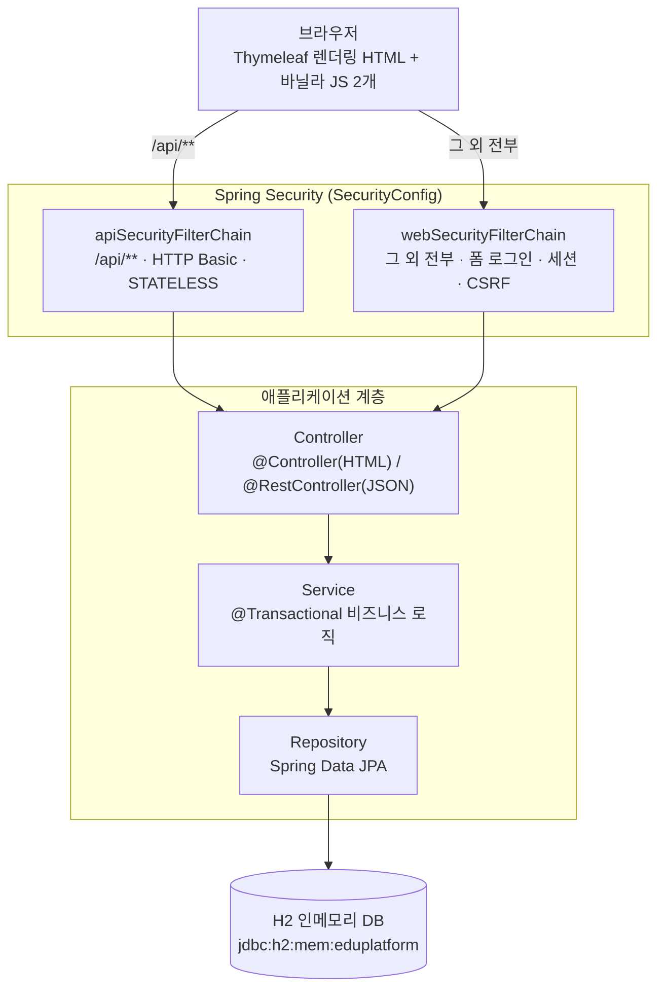
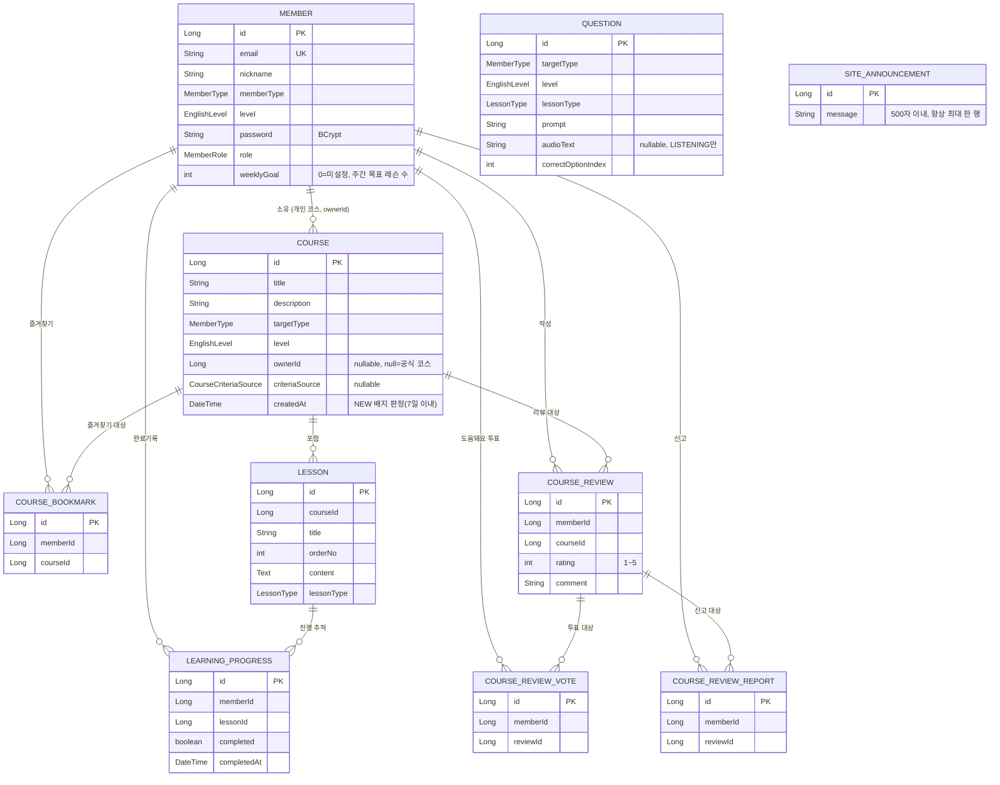
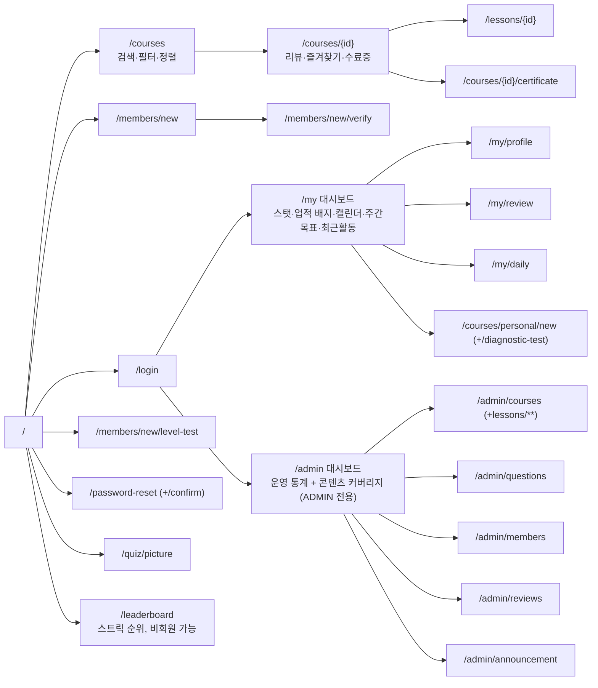

# eduplatform 개발기획서

초등학생·성인 대상 영어 학습 플랫폼의 기술 설계 문서. 무엇을 만드는지는
[PRODUCT.md](PRODUCT.md), 실제 완성된 산출물 전체 목록은 [DELIVERABLE.md](DELIVERABLE.md) 참고.
이 문서는 Phase 1(회원 기반)부터 Phase 6(인증)까지의 최초 로드맵과, 그 이후 실제로 이어진 확장
개발 전체를 최종 아키텍처 기준으로 정리했다.

---

## 1. 서비스 목표

- 초등학생과 성인 모두 사용하는 영어 학습 사이트.
- 영어 **입문(BEGINNER)** 단계부터 시작해 단계별로 학습을 제공.
- 회원의 유형(초등/성인)과 레벨에 맞는 코스를 추천·제공하고, 약점 영역 기반 개인 코스로 보완한다.
- 학습 진행 상황을 기록하고 진도율·스트릭·복습 주기를 관리한다.

## 2. 기술 스택

| 항목 | 버전/선택 |
|------|-----------|
| Java | 21 (LTS) |
| Spring Boot | 4.1.0 |
| Spring Framework | 7.x |
| Spring Security | 7.1.0 (폼 로그인 + BCrypt + 역할 기반 인가) |
| 빌드 도구 | Gradle 9.5.1 (Groovy DSL) |
| ORM | Spring Data JPA / Hibernate 7.4 |
| View | Thymeleaf 서버 렌더링 + `thymeleaf-extras-springsecurity6`(`sec:authorize`) |
| DB | H2 인메모리(`ddl-auto: create`, 재시작마다 샘플 데이터 재시딩) |
| 클라이언트 JS | 순수 바닐라 JS 2개 파일(`lesson-audio.js`: TTS·음성인식, `theme-toggle.js`: 다크모드) — 프레임워크·번들러 없음, AJAX 미사용(모든 폼은 서버 렌더링 POST-Redirect-GET) |
| 기타 | Lombok |

## 3. 사용자 유형

| 유형 | 설명 | 특징 |
|------|------|------|
| 초등학생(CHILD) | 어린이 학습자 | 쉬운 UI, 마스코트 인사말, 짧은 레슨 |
| 성인(ADULT) | 성인 학습자 | 실용 회화·문법 중심, 밀도 있는 레슨 |

레벨: `BEGINNER`(입문) → `ELEMENTARY`(초급) → `INTERMEDIATE`(중급) → `ADVANCED`(고급)

## 4. 패키지 구조 (package-by-feature)

```
com.edu.eduplatform
├── common/        JPA Auditing, WebMvc 설정, SecurityConfig, 샘플 데이터 시더, 관리자 통계·커버리지 대시보드, 랜딩 페이지, 업적 배지·리더보드(Progress+Course/Member를 넘나드는 집계)
├── member/        회원, 인증(로그인/가입/탈퇴/비밀번호), 이메일 인증·재설정 토큰, 관리자 회원 관리(강제 탈퇴 포함)
├── course/        코스(공식/개인), 즐겨찾기, 평점/리뷰(+도움돼요 투표·신고), 관리자 코스·리뷰 관리, 수료증
├── lesson/        레슨, 콘텐츠 파싱·아이콘 매핑, 이해도 퀴즈, 관리자 레슨 관리
├── progress/      학습 진행, 대시보드 집계, 스트릭·캘린더·주간 목표·최근 활동, 간격 반복 복습(+헤더 배지), 리더보드용 회원별 스트릭 집계
├── question/      진단 테스트/레벨 배치 문항, 관리자 문항 관리
├── quiz/          그림 퀴즈, 매일 단어장/단어 퀴즈 (모두 저장 없이 그때그때 생성하는 stateless 설계)
└── announcement/  사이트 전체 공지 배너(단일 슬롯 upsert), 관리자 공지 관리
```

각 패키지 안에 `domain / repository / service / controller`(+ 필요 시 `dto`, `exception`, `security`)를
둔다. 연관관계는 `@ManyToOne` 없이 **id 참조(Long)** 로 느슨하게 둔다 — 다만 `progress`/`course` 등
다른 패키지의 리포지토리를 서비스에서 직접 주입해 N+1을 피하는 배치 조회는 여러 곳에서 씀
(`LessonRepository.findByCourseIdIn`, `MemberRepository.findAllById` 등). 서비스 간 순환 의존을
피하려고, "회원 존재를 검증해야 하는 서비스(`CourseService`, `ProgressService`)는 `MemberService`를
주입받고, 반대로 `MemberService`는 다른 도메인 서비스 대신 그 리포지토리를 직접 주입받는다"는 방향
규칙을 지킨다(예: 회원 탈퇴 시 개인 코스·진행기록을 지우는 `MemberService.withdraw()`).

### 4-1. 시스템 구조

브라우저 요청이 인증 방식이 다른 두 개의 `SecurityFilterChain`(6절) 중 하나를 거쳐 컨트롤러 →
서비스 → 리포지토리로 내려가는 단순 계층형 구조다. 프론트엔드 빌드·API 게이트웨이·메시지 큐 같은
별도 인프라 없이 하나의 Spring Boot 프로세스 + H2 인메모리 DB로 전체를 서빙한다.



## 5. 도메인 모델

전체 엔티티와 관계는 아래 다이어그램 하나로 요약된다. 화살표는 "느슨한 id 참조" 방향이며(외래키
제약은 실제로 걸지 않음, 4절 참고), `Question`은 다른 엔티티를 참조하지 않는 독립 카탈로그라 연결선이
없다.



> `SITE_ANNOUNCEMENT`는 다른 엔티티와 관계가 없는 독립 싱글턴 테이블(존재 여부 자체가 배너 표시
> 여부) — 관계선 없이 별도 표기.

### Member (회원)
| 필드 | 타입 | 설명 |
|------|------|------|
| id | Long | PK |
| email | String | 로그인 ID, unique |
| nickname | String | 표시 이름 |
| memberType | Enum | CHILD / ADULT |
| level | Enum | 현재 학습 레벨 |
| password | String | BCrypt 해시(평문 저장 안 함) |
| role | Enum | USER / ADMIN |
| weeklyGoal | int | 주간 목표 레슨 수, 0=미설정(가입 시 기본값) |

세터 없음 — `changeNickname`/`changeLevel`/`changePassword`/`changeRole`/`changeWeeklyGoal` 등
의미 있는 메서드로만 상태를 바꾼다.

### Course (코스)
| 필드 | 타입 | 설명 |
|------|------|------|
| id | Long | PK |
| title, description, emoji | String | 표시 정보 |
| targetType, level | Enum | 대상·난이도 |
| ownerId | Long (nullable) | null=공식 코스, 값 있으면 그 회원의 개인 코스 |
| focusAreas | Set\<LessonType\> | 개인 코스가 비중을 두는 영역(복수), 공식 코스는 비움 |
| criteriaSource | Enum (nullable) | SELF_SELECTED / HISTORY_BASED / DIAGNOSTIC_TEST |

공식 코스와 개인 코스는 같은 테이블·같은 화면·같은 진도 추적 로직을 공유한다. 개인 코스의 레슨은
공식 코스 레슨을 **복사**해서 만든다(다대다 공유 없음) — `CourseService.buildPersonalCourse()`가
자가선택/이력기반/진단테스트 세 진입점의 공통 로직.

### CourseBookmark / CourseReview / CourseReviewVote / CourseReviewReport (참여 기능)
| 엔티티 | 필드 | 설명 |
|--------|------|------|
| CourseBookmark | memberId, courseId | 회원이 즐겨찾기한 코스, 존재 여부로 토글 |
| CourseReview | memberId, courseId, rating(1~5), comment | 회원당 코스 하나에 리뷰 하나(재작성 시 upsert) |
| CourseReviewVote | memberId, reviewId | 리뷰 "도움돼요" 투표, 존재 여부로 토글(즐겨찾기와 동일 패턴) |
| CourseReviewReport | memberId, reviewId | 리뷰 신고 — 취소 개념 없이 접수만(중복 신고는 조용히 무시) |

네 엔티티 전부 같은 최소 구조(회원 id + 대상 id)로, 배치 집계(`countByXxxIdIn`)를 통해 코스·리뷰
목록 카드에서 N+1 쿼리 없이 평점/즐겨찾기 수/도움돼요 수/신고 수를 한 번에 계산한다.

### Lesson (레슨)
| 필드 | 타입 | 설명 |
|------|------|------|
| id | Long | PK |
| courseId | Long | 소속 코스 |
| title, orderNo | String, int | 레슨명, 코스 내 순서(관리자 화면에서 위/아래 재배치 가능) |
| content | Text(`@Lob`) | `INTRO:`/`"영어 — 한국어"` 줄 컨벤션으로 파싱(`LessonService.parseContent`) |
| lessonType | Enum | VOCAB / READING / WRITING / LISTENING / SPEAKING |

### LearningProgress (학습 진행)
| 필드 | 타입 | 설명 |
|------|------|------|
| id | Long | PK |
| memberId, lessonId | Long | 학습자·대상 레슨 |
| completed | boolean | 완료 여부 |
| completedAt | DateTime | 완료 시각 — 스트릭·캘린더·간격 반복 복습 판정에 재사용 |

새 추적 테이블을 늘리지 않고 이 하나의 `completedAt` 값만으로 스트릭(연속일 계산), 월간 활동
캘린더, 복습 대상 판정(완료 후 3일 경과)까지 전부 계산한다.

### Question (진단 테스트 / 레벨 배치 문항)
| 필드 | 타입 | 설명 |
|------|------|------|
| id | Long | PK |
| targetType, level, lessonType | Enum | 특정 레슨이 아니라 대상·레벨·영역에 매인 문항 |
| prompt | String | 문제 텍스트 |
| audioText | String (nullable) | LISTENING 문항, `speechSynthesis`로 재생 |
| options | List\<String\> (`@OrderColumn`) | 4지선다 보기 |
| correctOptionIndex | int | 정답 인덱스 |

대상×레벨 8개 조합 × 5개 영역 × 2문항 = 80문항 시드(`QuestionDataInitializer`, 관리자 화면에서
추가·수정 가능). 응시 원시 답안은 저장하지 않는다 — 제출 즉시 채점해 영역별 정답률이 가장 낮은
영역(동률이면 모두)을 뽑고, 그 결과로 만들어진 개인 코스 자체가 기록이라 stateless로 둔다.

> 그림 퀴즈·매일 단어장·레슨 내 이해도 퀴즈도 같은 stateless 원칙 — 별도 문제 테이블 없이, 기존
> 레슨 콘텐츠에서 매 요청(그림 퀴즈·단어장은 날짜를 시드로) 결정론적으로 문제를 만들어낸다
> (`DailySeed`, `QuizWordPicker`).

### SiteAnnouncement (사이트 공지 배너)
| 필드 | 타입 | 설명 |
|------|------|------|
| id | Long | PK |
| message | String(500) | 공지 문구 |

"활성" 플래그 없이 **행의 존재 여부 자체가 표시 여부** — `SiteAnnouncementService.save()`가 있으면
갱신·없으면 생성해 항상 최대 한 행만 유지한다(리뷰 upsert와 같은 패턴). 모든 페이지 헤더에서
`@ControllerAdvice`(`SiteAnnouncementControllerAdvice`)가 매 요청마다 현재 메시지를 모델에
채워 넣는다.

## 6. 보안 아키텍처

- **두 개의 `SecurityFilterChain`으로 분리**(`SecurityConfig`) — `formLogin`과 `httpBasic`을 같은
  체인에 두면 인증 실패 시 응답 방식이 서로 덮어써서 분리가 필요했다.
  - `apiSecurityFilterChain`(`/api/**`): HTTP Basic, `STATELESS`, CSRF 없음. 회원 데이터를 바꾸는
    엔드포인트만 인증을 요구하고 `@CurrentMemberId`(인증된 사용자)로 memberId를 가져온다 — 요청
    본문의 memberId를 신뢰하지 않는다.
  - `webSecurityFilterChain`(그 외 전부): 이메일+비밀번호 세션 로그인, CSRF 보호, 역할 기반 인가
    (`/admin/**` → `ROLE_ADMIN`).
- **회원 식별**: `@CurrentMemberId` 커스텀 애너테이션 + `CurrentMemberIdArgumentResolver`(전역
  등록) + `MemberPrincipal`(로그인 시점 스냅샷) 조합으로 컨트롤러 시그니처를 통일. 이 세 파일만
  손대면 인증 방식을 바꿀 수 있게 미리 분리해둔 구조.
- **무차별 대입 방지**: `LoginAttemptService`가 Spring Security의 인증 성공/실패 이벤트를 구독해
  이메일별 실패 횟수를 인메모리로 추적, 5회 실패 시 15분 잠금.
- **회원가입 이메일 인증**: `EmailVerificationService`가 6자리 코드를 인메모리로 관리(10분 유효),
  실제 SMTP 없이 서버 로그로 코드를 출력하는 방식으로 검증 흐름만 구현.
- **비밀번호 재설정**: `PasswordResetTokenService`가 같은 패턴(30분 유효 토큰)으로 재설정 링크를
  로그에 출력.
- **응답 헤더**: Content-Security-Policy(`script-src 'self'`, h2-console만 예외), Referrer-Policy,
  Permissions-Policy(마이크는 SPEAKING 기능 때문에 self 허용), HSTS.
- **비회원 콘텐츠 제한**: 로그인하지 않은 사용자는 코스별 첫 레슨만 열람 가능, 두 번째 레슨부터는
  회원가입 유도 화면으로 대체.

## 7. 화면 설계 (Thymeleaf)



| 영역 | 경로 | 설명 |
|------|------|------|
| 공개 | `/`, `/courses`, `/courses/{id}`, `/courses/{id}/certificate`, `/lessons/{id}` | 랜딩, 코스 목록/상세(검색·필터·정렬·평점·즐겨찾기·리뷰), 수료증(완료자만), 레슨 학습(비회원은 1과만) |
| 계정 | `/members/new` → `/members/new/verify`, `/login`, `/members/new/level-test`, `/password-reset`(+`/confirm`) | 이메일 인증 2단계 가입, 로그인, 레벨 배치 테스트, 비밀번호 찾기 |
| 마이페이지 | `/my`(업적 배지 포함), `/my/profile`(주간 목표 포함), `/my/review`, `/my/daily`, `/courses/personal/new`(+`/diagnostic-test`) | 대시보드, 프로필/비밀번호/탈퇴, 간격 반복 복습, 오늘의 단어, 개인 코스 생성 |
| 참여 | `/quiz/picture`, `/leaderboard` | 그림 퀴즈, 학습 리더보드(둘 다 비회원 가능) |
| 관리자 | `/admin`(통계+커버리지), `/admin/courses`(+`/{id}/lessons/**`), `/admin/questions`, `/admin/members`(+강제 탈퇴), `/admin/reviews`, `/admin/announcement` | 대시보드, 코스·레슨 CRUD, 문항 관리, 회원 관리, 리뷰 관리, 공지 관리 |
| 개발용 | `/h2-console` | DB 콘솔(CSP 예외) |

## 8. API 설계 (REST, `/api`)

| 메서드 | 경로 | 인증 | 기능 |
|--------|------|------|------|
| POST | `/api/members` | 공개 | 회원 가입(즉시 생성, 웹 화면의 이메일 인증 플로우와 별개) |
| GET | `/api/members/{id}` | 공개 | 회원 조회 |
| GET | `/api/courses` | 공개 | 코스 목록(대상/레벨/영역/키워드 필터) |
| POST | `/api/courses` | ADMIN | 코스 등록 |
| GET | `/api/courses/{id}/lessons` | 공개 | 코스의 레슨 목록 |
| POST | `/api/courses/personal` | 인증 필요 | 개인 코스 생성(자가 선택) |
| POST | `/api/courses/personal/history-based` | 인증 필요 | 개인 코스 생성(학습 이력 기반) |
| POST | `/api/courses/personal/diagnostic-test` | 인증 필요 | 개인 코스 생성(진단 테스트 채점) |
| GET | `/api/questions/diagnostic-test` | 공개 | 대상·레벨별 진단 테스트 문항(정답 인덱스 제외) |
| POST | `/api/progress/complete` | 인증 필요 | 레슨 완료 처리 |

요청/응답은 전부 DTO(record)로 분리하고 엔티티를 직접 노출하지 않는다. 코스 즐겨찾기·평점/리뷰
(+도움돼요 투표·신고)·수료증·복습·주간 목표·업적 배지·리더보드·관리자 기능(회원/리뷰/공지/통계)
전부 화면 전용으로 판단해 REST API를 별도로 열지 않았다 — 이 프로젝트가 실제로 필요로 한 API는
처음 10개에서 늘어나지 않았고, 나머지는 서버 렌더링 폼 제출/조회만으로 충분했다(필요해지면 후속 확장).

## 9. 개발 단계 (완료된 로드맵)

### Phase 1~4 — 회원 · 코스/레슨 · 학습 진행 · 콘텐츠 강화 (완료)
회원 가입/조회, 코스·레슨 CRUD와 학습 화면, 레슨 완료 처리와 진도율, 레슨 타입별 콘텐츠(플래시카드
+아이콘)까지 기본기를 갖췄다.

### Phase 5 — 개인화 (완료)
개인 코스 도입, 비중 기준 3방식(자가 선택 → 학습 이력 기반 → 진단 테스트) 모두 구현, 대상·레벨·
영역 필터, 학습 대시보드(진도율·영역별 진도·스트릭·월간 캘린더).

### Phase 6 — 인증 · 보안 강화 (완료)
Spring Security 도입, REST API의 memberId 신뢰 문제 보완, 로그인 시도 제한, 이메일 인증 회원가입,
비밀번호 재설정, 회원 탈퇴, 보안 응답 헤더, 비회원 콘텐츠 제한.

### Phase 7 — 참여·리텐션 기능 (완료, 최초 로드맵엔 없던 확장)
그림 퀴즈, 매일 단어장/단어 퀴즈, 간격 반복 복습 + 헤더 배지, 코스 즐겨찾기, 코스 평점/리뷰,
코스 완료 시 다음 코스 자동 안내, 코스 검색(레슨 본문 포함).

### Phase 8 — 관리자 도구 (완료, 최초 로드맵엔 없던 확장)
코스/레슨/문항/회원을 코드 편집 없이 관리하는 관리자 화면 일체, 콘텐츠 커버리지 대시보드(대상×
레벨×영역 조합별 빈 칸을 한눈에 확인).

### Phase 9 — UX/접근성 (완료, 최초 로드맵엔 없던 확장)
반응형 모바일 대응, 다크모드, 웹 접근성(a11y) 점검·개선.

### Phase 10 — 신뢰·커뮤니티 신호 (완료, 최초 로드맵엔 없던 확장)
코스 평점·후기에 도움돼요 투표·신고를 더해 신뢰도 있는 후기 생태계로 발전, 코스 인기순 정렬·
학습자 수·신규 배지·예상 학습 시간으로 코스 목록의 정보 밀도를 높임, 코스 완료 수료증으로
성취를 남기는 장치 추가.

### Phase 11 — 동기부여 고도화 (완료, 최초 로드맵엔 없던 확장)
주간 학습 목표 설정 + 진도율, 최근 학습 활동 히스토리 — 기존 스트릭·캘린더가 "얼마나"만 보여주던
것을 "무엇을"·"목표 대비 얼마나"까지 확장.

### Phase 12 — 관리자 도구 고도화 (완료, 최초 로드맵엔 없던 확장)
관리자 회원 강제 탈퇴, 리뷰 관리(신고 확인·삭제), 공지사항 배너, 운영 통계 대시보드(가입자·활동
추이 그래프) — 콘텐츠 관리 중심이던 관리자 도구를 회원·커뮤니티·운영 지표 관리까지 확장.

### Phase 13 — 업적·경쟁 동기부여 (완료, 최초 로드맵엔 없던 확장)
학습 업적 배지(13종, 완료 레슨·코스 완주·스트릭·주간목표·리뷰·즐겨찾기·개인 코스 기준으로 즉석
계산) + 학습 리더보드(스트릭 기준 전체 회원 순위, 비회원도 열람 가능) — 개인 지표 중심이던
동기부여 장치에 "나 혼자 vs 남들과 비교"라는 두 축을 완성. 둘 다 새 추적 테이블 없이 기존
`LearningProgress`만으로 계산하는 stateless 설계를 그대로 유지.

### 다음 단계 (미착수, 의도적으로 후순위)
- 마스코트 캐릭터 이미지 연결(사용자가 이미지 파일을 전달하면 진행).
- 운영 DB 전환(H2 → MySQL/PostgreSQL 등), 배포 파이프라인 구성.

## 10. 기술 결정 메모

- 개발 DB는 H2 인메모리(`ddl-auto: create`) 그대로 유지 — 운영 DB 전환은 의도적으로 최후순위.
- 뷰는 Thymeleaf 서버 렌더링을 전 구간에서 유지, REST API는 화면이 필요 없는 순수 데이터 제공
  용도로만 최소 사용. 클라이언트 JS는 브라우저 내장 API(TTS·음성인식·다크모드 토글)를 감싸는
  용도로만 2개 파일에 한정, AJAX/프레임워크 도입 없음.
- 실제 메일 발송 인프라(SMTP)가 없어, 이메일 인증·비밀번호 재설정은 "서버 로그에 코드/링크 출력"으로
  시뮬레이션 — 나중에 SMTP를 붙이면 로그 출력 한 줄만 교체하면 되도록 서비스 레이어를 분리해둠.
- 검증(Bean Validation)은 DTO에서, 서비스 레벨 방어 검증(예: 별점 범위, 포커스 영역 필수)은 각
  서비스 메서드에서 전용 예외로 처리 — 전역 `@RestControllerAdvice`형 예외 변환은 API 컨트롤러별
  `@ExceptionHandler`로 두고, 화면 컨트롤러는 try/catch 후 에러 메시지와 함께 폼을 다시 그리는
  패턴을 일관되게 사용.
- 회원 탈퇴·역할 변경처럼 "자기 자신에게 위험한" 작업엔 서비스 레벨 가드(관리자 자기 탈퇴 금지,
  자기 역할 변경 금지)를 둬서 잠금 사고를 예방.
